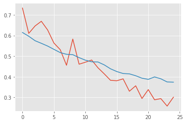
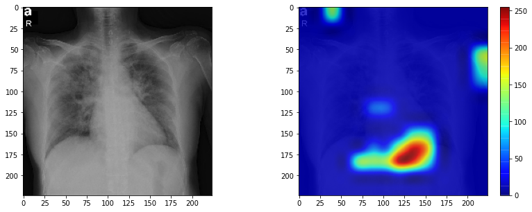

# COVID-19 Detector using Convolutional Neural Networks

Detecting whether an individual is affected by the recent outbreak of the novel coronavirus COVID-19 using an X-Ray image of their chest. 
The model is trained on an open dataset available at [this link]() . Testing images were obtained separately. The model also uses GradCAM (Gradient-weighted Class Activation Maps) to help the user see what exactly the model is paying attention to, to give the final result.

## Installation

Use the package manager [pip](https://pip.pypa.io/en/stable/) to install the following libraries.

```bash
pip install Keras
pip install scikit-learn
pip install imutils
pip install numpy
pip install opencv
```

## Usage

Change the following lines with appropriate paths to your images

```python
imagePaths=list(paths.list_images("/content/drive/My Drive/covid19-dataset"))

model=load_model("/content/drive/My Drive/covid19-dataset/covid191.h5")
_img=load_img("/content/drive/My Drive/covid19-dataset/testing-set/test1.jpg",target_size=(224,224))
image=cv2.imread("/content/drive/My Drive/covid19-dataset/testing-set/test1.jpg")
```

## Results
The accuracy-loss graph can be seen below:



The predictions are in the iPython Notebook itself, and a demo of the GradCAM visualisation can be seen as follows:
 
